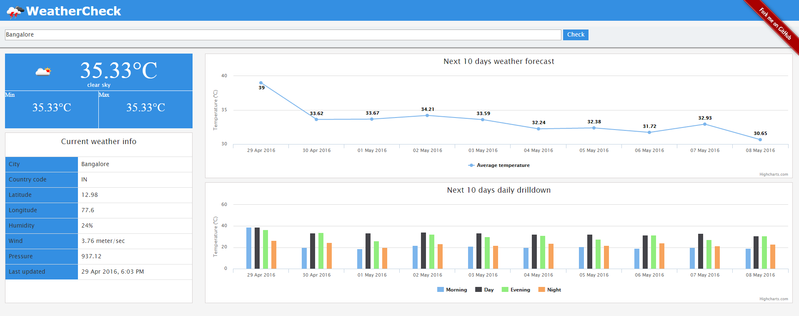

WeatherCheck - AngularJS mashup to check weather
================================================

This application is a Web 2.0 mashup developed using the following technologies:

i) AngularJS

ii) Twitter Bootstrap

iii) Highcharts

The backend is powered by OpenWeatherMap API (http://openweathermap.org/)

The main intention of developing this application is to get a hands-on experience on the technologies mentioned above
and at the same time building an application to have a quick info of the current weather in a city.

DEMO
http://www.rajapradhan.com/weathercheck/app

 
You can reach me at:
rajapradhan08@gmail.com

To know more about me visit:
www.rajapradhan.com